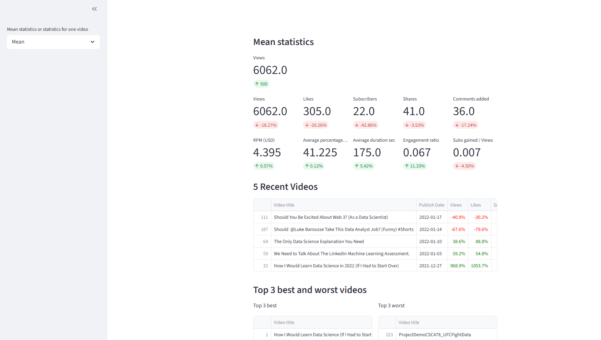
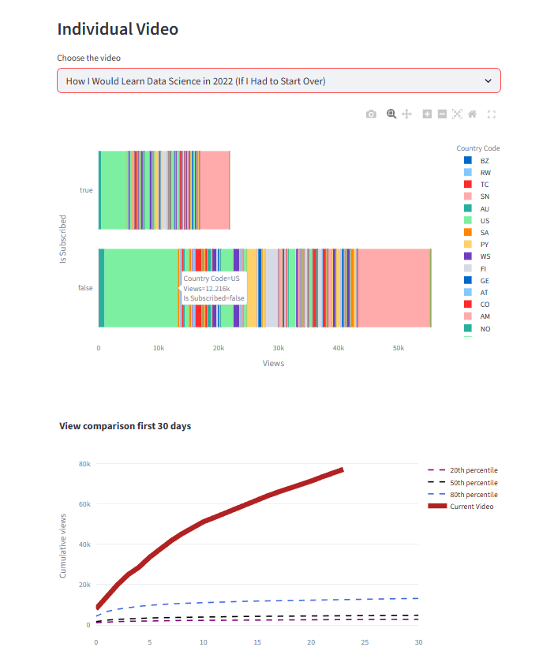

# YouTube Analytics Dashboard

Интерактивный дашборд для анализа статистики YouTube канала с возможностью отслеживания ключевых метрик, анализа комментариев и визуализации трендов.

## Возможности

- **Общая аналитика** - просмотры, лайки, подписчики и другие метрики
- **Статистика по видео** - детальный анализ каждого видео
- **Анализ комментариев** - определение тональности с помощью VADER
- **Сравнение периодов** - медианные значения за 6 и 12 месяцев
- **Топ видео** - лучшие и последние видео
- **WordCloud** - визуализация частотности слов в комментариях

## Скриншоты

### Главный дашборд

*Основной экран с общей статистикой и ключевыми метриками*

### Индивидуальная статистика видео

*Детальный анализ конкретного видео: просмотры, лайки, комментарии, тональность*

### Средняя статистика

*Сравнение медианных значений метрик за последние 6 и 12 месяцев*

### Последние и топ видео

*Таблица с последними видео и выделение отрицательных значений*

### Анализ комментариев

*Анализ тональности комментариев с использованием VADER и WordCloud визуализация*

- **Streamlit** - веб-интерфейс
- **Pandas** - анализ данных
- **Plotly** - графики
- **VADER** - анализ тональности комментариев
- **WordCloud** - визуализация частоты слов

